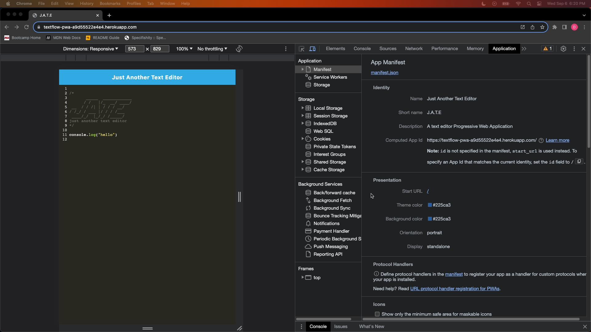
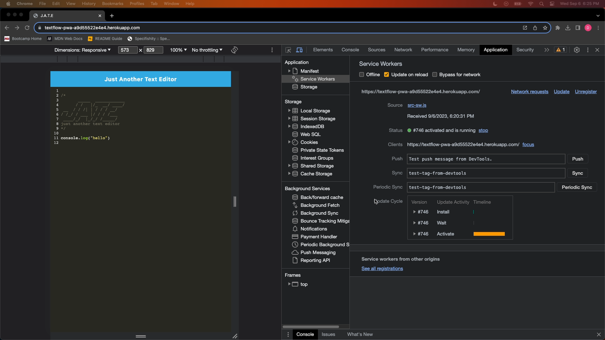
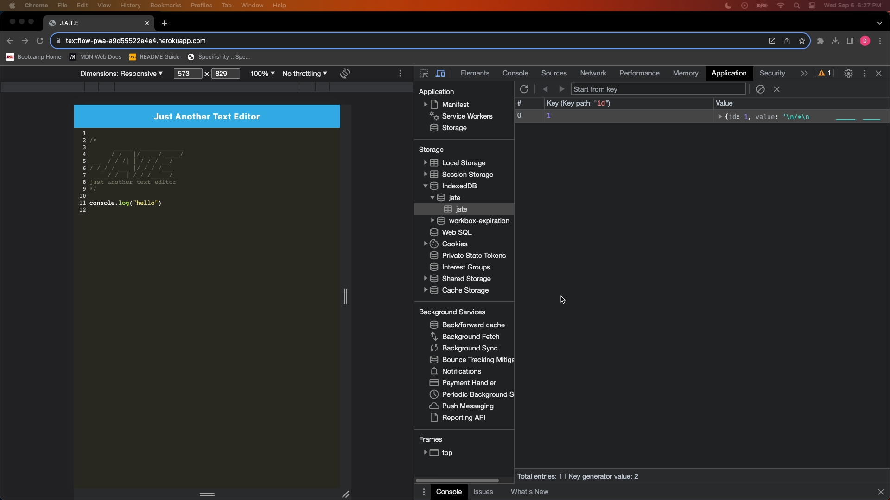

# TextFlow-PWA

## Description

This is a Progressive Web Application (PWA) text editor that allows you to create and save notes or code snippets, with or without an internet connection. It's a single-page application that meets the PWA criteria, ensuring reliable data persistence even when offline.

## Table of Contents

- [Installation](#installation)
- [Usage](#usage)
- [Mock-Up](#mock-up)
- [Links](#links)

## Installation

- JavaScript
- IndexedDB
- Webpack
- Workbox
- Babel

To install the project, use the following command: 

```
npm install
```

## Usage 

Once installed, to run the application use the following application:
```
npm run start
```

## Mock-Up

The following animation demonstrates the application functionality:

.gif)

The following image shows the application's `manifest.json` file:



The following image shows the application's registers service worker:



The following image shows the application IndexedDB storage:



## Links

- Deployed Application: https://textflow-pwa-a9d55522e4e4.herokuapp.com/
- GitHub Repo: https://github.com/derricn2/TextFlow-PWA
